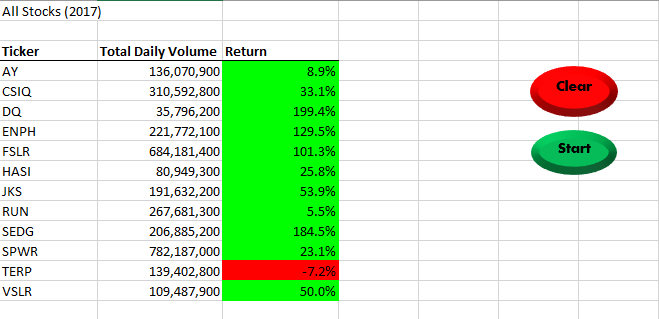

# VBA_Challenge
Refactor VBA code and measure performance.
 
 # VBA with Visual Basic for 
 Creating a VBA (Visual Basic for Applications) script helps better analyze the stock market data. VBA is perfect for creating macros to automate repetitive processes like this challenge.
 
 ## Background
 I created a VBA (Visual Basic) script to analyze some stock market data for this project. Also, The data is inside a Microsoft Excel workbook and includes stock data for two years (2017 and 2018). Finally, The stock data or the main data has two sheets categorized yearly 2017, and 2018.

##### Source:https://gfycat.com/babyishbetterhammerheadbird

# Results 

The tickers ENPH and RUN had would have been considered good investments due to the positive returns in 2018, and both tickers had increases greater than $200,000,000 over the 2017 total daily volumes.

 

 
# Summary
## 1. What are the advantages or disadvantages of refactoring code?
### Advantages
Refactoring improves the design of the code, makes the code  easier to understand, helps us find bugs and also helps in executing the macro faster. There is an additional benefit of refactoring. It changes the way a developer thinks about the implementation when not refactoring.

### Disadvantages
Refactoring nearly always includes renaming variables and methods, changing method signatures, and moving things around. Trying to make all these changes by hand can easily lead to disaster.
